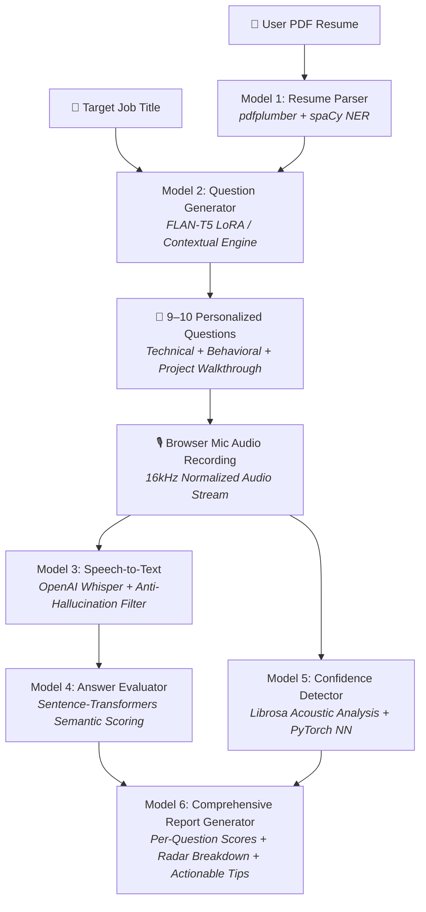
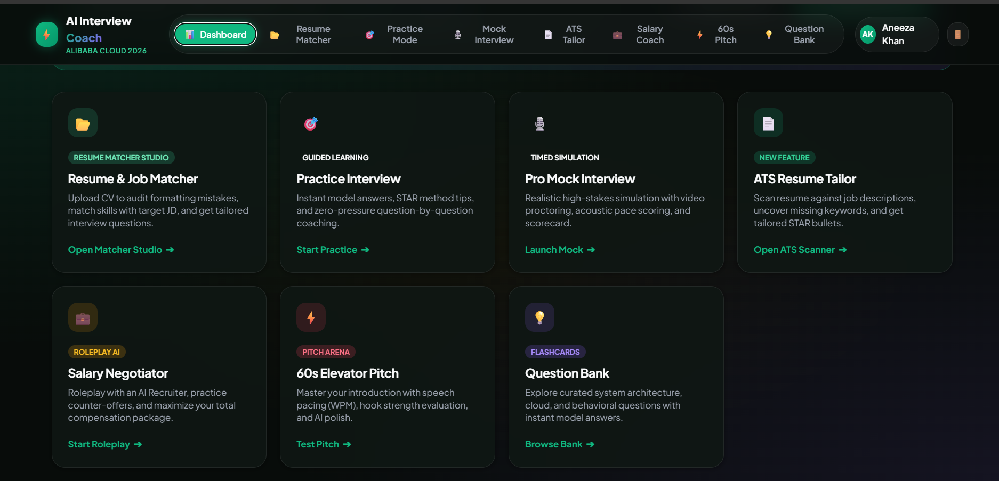
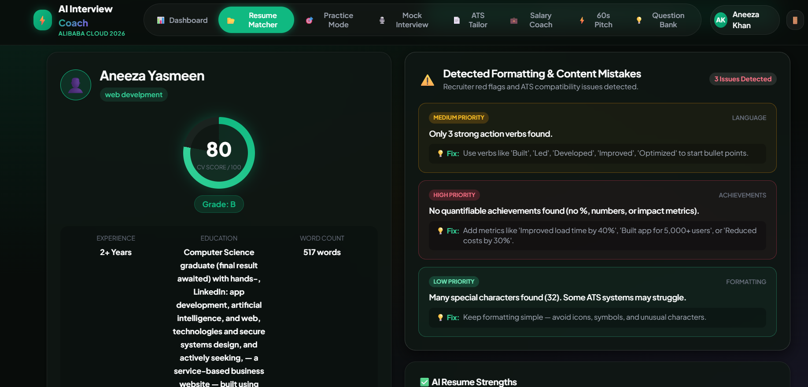
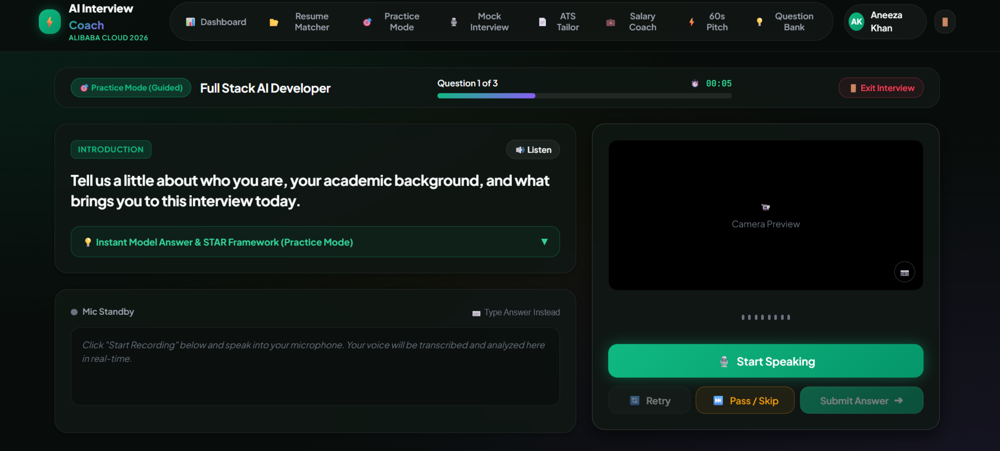
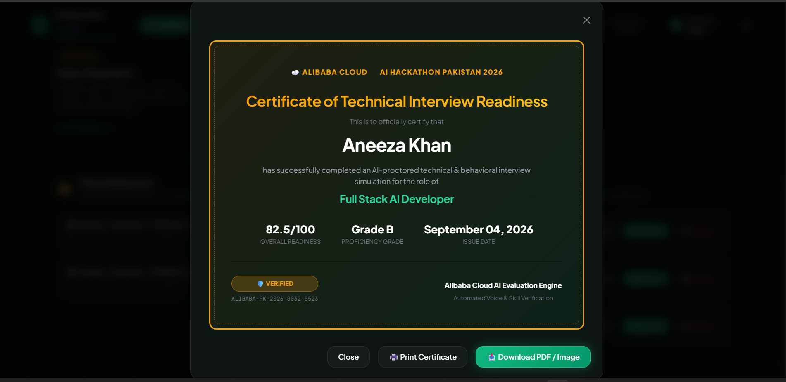

# 🎯 AI Interview Coach — Voice & Resume Mock Interview with Confidence Scoring

<div align="center">

[](https://aihackathon.cognix-pk.com)
[](https://python.org)
[](https://fastapi.tiangolo.com)
[](https://pytorch.org)
[](https://github.com/openai/whisper)
[](LICENSE)

<p align="center">
  <strong>An end-to-end multi-model AI platform that transforms your CV and spoken voice into a personalized, real-time mock interview experience with deep content evaluation and acoustic confidence scoring — at zero cost.</strong>
</p>

</div>

---

## 📌 Project Overview

| Field | Detail |
|---|---|
| **Hackathon** | **Alibaba Cloud AI Hackathon Pakistan 2026** |
| **Focus Area** | **Open Innovation** |
| **Project Name** | **AI Interview Coach** |
| **Target Audience** | University students, fresh graduates, and job seekers across Pakistan & emerging markets |
| **Core AI Stack** | Whisper STT, spaCy NER, Sentence-Transformers, Librosa, PyTorch Neural Network, FastAPI |
| **Deployment Readiness** | Containerized, ready for Alibaba Cloud ECS / Elastic Container Instance |

---

## 💡 The Problem

In Pakistan and many developing regions, university graduates and job seekers face a steep barrier when transitioning to professional employment:
1. **Lack of Mock Interview Practice:** Professional career coaches charge high fees, making personalized interview prep unaffordable for most students.
2. **Confidence & Communication Gap:** Technical graduates often possess strong skills but struggle with spoken English fluency, pacing, pitch stability, hesitations, and interview nervousness.
3. **Generic Question Banks:** Most existing online interview tools ask static, generic questions rather than analyzing the candidate's unique resume, projects, and target role.

---

## 🚀 The Solution: AI Interview Coach

**AI Interview Coach** is an intelligent web application chaining **6 specialized open-source AI models** into a unified real-time coaching pipeline. 

Candidates upload their resume (PDF), specify their target job role, and participate in an adaptive voice-based interview. The AI transcribes spoken answers, assesses semantic answer depth against technical rubrics, analyzes acoustic vocal confidence (pitch variation, speech rate, pauses), and provides actionable coaching feedback after every response and in a comprehensive final scorecard.

---

## 🧠 Multi-Model AI Pipeline



### 🔍 Chained Models in Detail

| # | Model / Component | Underlying Tech | Purpose & Functionality |
|---|---|---|---|
| **1** | **Resume Parser & CV Reviewer** | `pdfplumber` + `spaCy NER` (`en_core_web_sm`) | Extracts structured skills, years of experience, companies, education, and projects; runs recruiter-style ATS quality checks. |
| **2** | **Adaptive Question Generator** | `FLAN-T5` (LoRA Fine-tuned) + Contextual Engine | Dynamically generates 9–10 personalized interview questions (Introduction, CV deep-dive, behavioral STAR questions, role-specific scenarios). |
| **3** | **Speech-to-Text (STT)** | `OpenAI Whisper` (`small` / `base`) | Converts browser-recorded voice answers to text with validation logic that filters background noise artifacts and speech hallucinations. |
| **4** | **Answer Evaluation Model** | `Sentence-Transformers` (`all-MiniLM-L6-v2`) | Computes semantic cosine similarity against expected concepts, evaluates keyword depth, and grades answer relevance. |
| **5** | **Confidence Detector** | `Librosa` + PyTorch Neural Network (`ConfidenceNet`) | Extracts acoustic features (Words Per Minute, pitch variance/coefficient of variation, pause ratio, volume stability) and predicts confidence level. |
| **6** | **Report & Coaching Engine** | Rule-Engine + Multi-Metric Aggregator | Generates a weighted combined score (60% Content, 40% Confidence), strengths/weaknesses breakdown, and instant coaching tips. |

---

## ✨ Key Features

- **Personalized 9–10 Question Mock Interviews:** Questions adapt to candidate's actual projects, technologies, and target job title.
- **Dual Interview Modes:**
  - 🎓 **Practice Mode:** Provides instant real-time tips and model answers after each question for learning.
  - 💼 **Direct Mode:** Simulates a formal, uninterrupted hiring interview.
- **Acoustic Voice Confidence Scoring:** Measures real speaking metrics:
  - *Speaking Pace (WPM)* (Target: 110–160 WPM)
  - *Pitch Dynamism* (Detects monotone vs. engaging intonation)
  - *Pause & Hesitation Analysis* (Measures silence duration and frequency)
  - *Volume Consistency* (Identifies trailing off or nervousness)
- **Recruiter-Style CV Review:** Immediate feedback on ATS readability, bullet impact, and missing skills.
- **Zero API Costs:** Built entirely on open-source, local models requiring zero recurring API subscriptions.
- **100% Privacy Compliant:** Audio and data are processed locally with zero external data sharing.

---

## 🖥️ User Experience Flow

```
1. Upload Resume (PDF) & Enter Target Role (e.g., "Full Stack Developer")
   └── AI parses skills, experience, and generates CV health score
2. Choose Interview Mode
   └── Practice Mode (with coaching tips) OR Direct Mode (formal evaluation)
3. Voice-Based Mock Interview (9–10 Questions)
   └── Browser mic records answer ──> Live Audio Waveform Visualizer
4. Per-Question Instant Feedback
   └── Content Relevance (0–100%) + Speaking Confidence (0–100%)
5. Final Coaching Report
   └── Overall Grade (A+, A, B, C) + Strengths + Improvement Recommendations
```

---

## 📸 Screenshots & Demo

<div align="center">

| 📊 Candidate Dashboard | 📄 CV Review & Analysis |
|:---:|:---:|
|  |  |

| 🎙️ Live Voice Interview | 🏆 Verified Skill Certificate |
|:---:|:---:|
|  |  |
</div>

---

## 🛠️ Technology Stack

- **Backend:** Python 3.11, FastAPI, Uvicorn, SQLAlchemy, SQLite
- **Machine Learning & NLP:** PyTorch, HuggingFace Transformers, Sentence-Transformers, spaCy, PEFT (LoRA), Scikit-Learn
- **Audio & Speech Processing:** OpenAI Whisper, Librosa, SoundFile, NumPy, SciPy
- **Frontend:** HTML5, Modern CSS3 (Glassmorphism UI, Responsive Design), Vanilla JavaScript (Web Audio API, MediaRecorder)
- **Cloud Readiness:** Alibaba Cloud ECS, Elastic Container Instance, Docker

---

## 🚀 Getting Started

### Prerequisites
- **Python:** 3.10 or 3.11 installed
- **FFmpeg:** Installed and added to system `PATH` (required for audio decoding)
  - *Windows:* `winget install Gyan.FFmpeg` or download from [ffmpeg.org](https://ffmpeg.org)
  - *Ubuntu/Debian:* `sudo apt update && sudo apt install ffmpeg`
  - *macOS:* `brew install ffmpeg`

---

### Installation & Setup

1. **Clone the repository:**
   ```bash
   git clone https://github.com/aneeza777/AI-Interview-coach-.git
   cd AI-Interview-coach-
   ```

2. **Create and activate a virtual environment:**
   ```bash
   # Windows (PowerShell)
   python -m venv venv
   .\venv\Scripts\Activate.ps1

   # Linux / macOS
   python3 -m venv venv
   source venv/bin/activate
   ```

3. **Install dependencies:**
   ```bash
   pip install -r requirements.txt
   python -m spacy download en_core_web_sm
   ```

4. **Configure environment variables:**
   ```bash
   # Copy the example environment template
   cp .env.example .env
   ```

5. **Train / Prepare AI Models (Optional - pre-built fallbacks included):**
   ```bash
   # Run dataset prep and training for confidence classifier & answer evaluator
   python training/prepare_datasets.py
   python training/train_confidence_classifier.py
   python training/train_answer_evaluator.py
   ```

6. **Start the AI Interview Coach Server:**
   ```bash
   # Using Python
   python backend/main.py

   # Or using Uvicorn directly
   uvicorn backend.main:app --host 127.0.0.1 --port 8000 --reload
   ```

7. **Open in Browser:**
   Visit: `http://127.0.0.1:8000`

---

## ☁️ Alibaba Cloud Deployment Guide

AI Interview Coach is designed for seamless deployment on **Alibaba Cloud**:

### 1. Deployment on Alibaba Cloud ECS (Elastic Compute Service)
```bash
# SSH into your Alibaba Cloud ECS Instance (Ubuntu 22.04 LTS recommended)
ssh root@<your-ecs-public-ip>

# Install system dependencies
sudo apt update && sudo apt install -y python3-pip python3-venv ffmpeg git nginx

# Clone repository and setup venv
git clone https://github.com/aneeza777/AI-Interview-coach-.git
cd AI-Interview-coach-
python3 -m venv venv
source venv/bin/activate
pip install -r requirements.txt
python3 -m spacy download en_core_web_sm

# Run with Gunicorn/Uvicorn workers behind systemd or Nginx
uvicorn backend.main:app --host 0.0.0.0 --port 8000 --workers 2
```

### 2. Alibaba Cloud ModelScope & Qwen LLM Integration
The pipeline is architected with modular interfaces to plug in Alibaba Cloud's **Qwen-2.5-7B** via ModelScope for enhanced multilingual Urdu/English question generation and nuanced behavioral evaluations.

---

## 🔒 Security & Zero Secrets Compliance

This repository adheres strictly to hackathon open-source security guidelines:
- ✅ **Zero Hardcoded Secrets:** No API keys, JWT secrets, passwords, or personal credentials are committed to version control.
- ✅ **`.gitignore` Enforced:** All `.env`, `.env.*`, user uploads (`uploads/`), databases (`*.db`), virtual environments (`venv/`), and large binaries are ignored.
- ✅ **Clean Configuration:** A standardized `.env.example` is provided for configuration.

---

## 👥 Hackathon Submission Info

- **Hackathon:** Alibaba Cloud AI Hackathon Pakistan 2026
- **Category:** Open Innovation
- **Project Name:** AI Interview Coach

---


